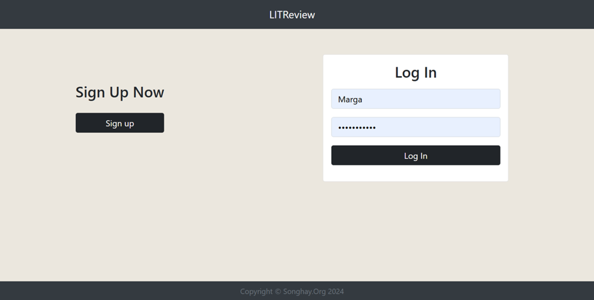
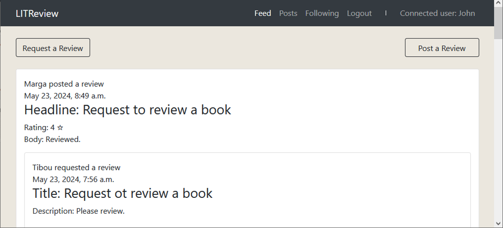
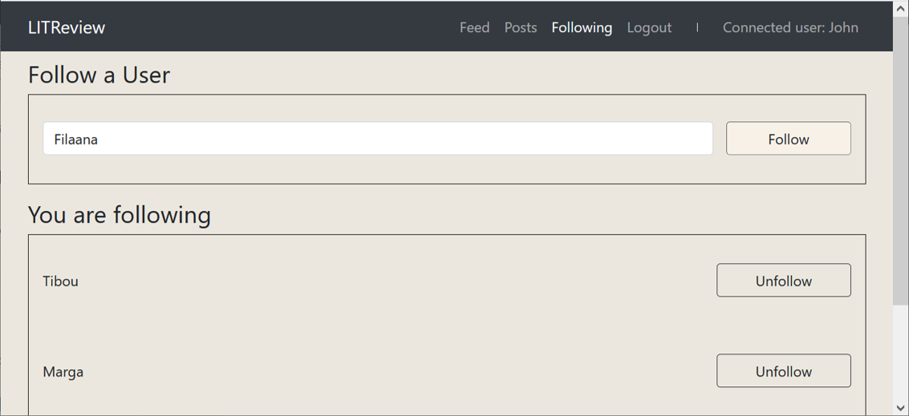

# Develop a Web Application Using Django

**OpenClassrooms - Python Developer Path:** Project 9

**Student:** Abdoul Baki Seydou

**Date:** 13/05/2023

## Table of Contents
1. [Summary](#summary)
2. [Features](#features)
3. [Technologies Used](#technologies-used)
4. [Project Tasks](#project-tasks)
5. [Local Development](#local-development)
   - [Prerequisites](#prerequisites)
   - [Setup on macOS/Linux](#setup-on-macoslinux)
   - [Setup on Windows](#setup-on-windows)
   - [Running the Application](#running-the-application)
   - [Admin Panel](#admin-panel)
   - [Linting](#linting)
   - [screenshots](#screenshots)

## Summary
This project consists of developing for **LITReview**, an up-and-coming startup, 
a secure web app that will allow users to request and publish reviews of books and articles.

The app needs to be created as an MVP (minimum viable product) using the Django framework. 
The focus will therefore be more on the backend, with the frontend being a clean and minimal UI matching 
the wireframes provided.

## Features
1. **Sign up and Log in:** to the application.
2. **Create a Ticket:** To request a review of a book/article.
3. **Create Review:** In response to created tickets.
4. **Create a Ticket and Review:** As part of one-step process.
5. **View Feed:** Of own tickets, reviews, and responses to own tickets.
6. **Edit Own Posts:** View, edit, update or delete own tickets and reviews.
7. **Follow:** Other users by entering their username.
8. **Unfollow:** Whoever they want.
9. **Logout:** They can log out of the system.

## Technologies Used
- **Programming Language:** Python, HTML, CSS, Javascript.  
- **Framework:** Django
- **Database:** SQLite

## Project Tasks
1. Create Django models in Database Schema.
2. Create Forms for data validation and transformation.
3. Create Views and Templates to handle API logic.
4. Define URL routes for the API.

## Local Development

### Prerequisites
- PostgreSQL installed.
- Python 3.6 or higher.

### Setup on macOS/Linux

1. **Clone the Repository**
   ```bash
   cd /path/to/put/project/in
   git clone https://github.com/Afudu/P9_OpenClassroom.git

2. **Move to the folder**
   ```bash
   cd P9_OpenClassroom

3. **Set Up Virtual Environment**
   ```bash
   python -m venv venv
   
4. **Activate Environment**
   ```bash
   source venv/bin/activate 

5. **Securely upgrade pip**
   ```bash
   python -m pip install --upgrade pip 

6. **Install dependencies**
   ```bash
   pip install -r requirements.txt
   
7. **To deactivate Environment**
   ```bash
   deactivate

### Setup on Windows

1. Follow the steps above.

2. To activate the environment:
   ```bash
   .\venv\Scripts\Activate

### Running the application

1. **Start the server**
   ```bash
   cd LITReview; python manage.py runserver
   
2. **Access in the browser**
- To test the application, navigate to:
  ```bash
  http://localhost:8000/

### Admin Panel
1. Create a superuser account
   ```bash
   python manage.py createsuperuser
2. Navigate to:
   ```bash
    http://localhost:8000/admin
3. Use the superuser user created above to log in.

### Linting

- **Run Linting**
  ```bash
  flake8
  
## Screenshots





